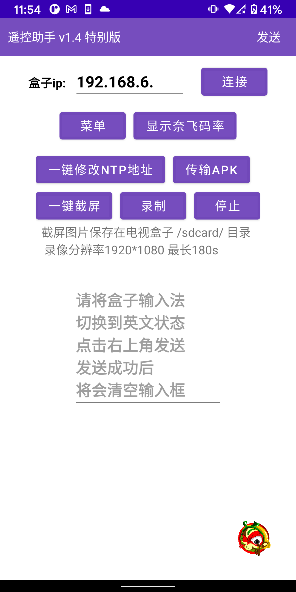

# 🎈遥控助手下载地址

## &#x20;APK下载地址v1.3版



## 遥控助手v1.4 特别版

<mark style="color:red;">**地址一   **</mark>https://pan.xunlei.com/s/VMmOClK0hdSSEXsqk6YplAAiA1 提取码：<mark style="background-color:green;">**d8se**</mark>

「链接：https://pan.xunlei.com/s/VMmOClK0hdSSEXsqk6YplAAiA1 提取码：d8se”复制这段内容后打开手机迅雷App，查看更方便」

<mark style="background-color:blue;">**地址二**</mark>：[<mark style="background-color:red;">谷歌网盘下载</mark>](https://bit.ly/3B0KOIh)    <mark style="background-color:red;"></mark>[<mark style="background-color:red;">https://bit.ly/3B0KOIh</mark>](https://bit.ly/3B0KOIh)<mark style="background-color:red;"></mark>

<mark style="color:red;background-color:red;">**视频说明**</mark><mark style="background-color:red;">：</mark>[<mark style="background-color:red;">https://www.ixigua.com/7020988161757020711</mark>](https://www.ixigua.com/7020988161757020711)<mark style="background-color:red;"></mark>


&#x20;注意，使用遥控助手需要打开电视盒子的USB调试模式

&#x20;项目地址：[https://github.com/ligl0702/Pan/releases/tag/info](https://github.com/ligl0702/Pan/releases/tag/info)


&#x20;**使用须知：**

**1**、电视盒子和手机需要连接到同一个wifi下。

**2**、其次电视盒子需要打开ADB开关。一般来说是需要在设置里--关于---内部版本号或者android版本号 点击4次 激活开发者选项后，找到【usb调试】或者【网络调试】或者【ADB开关】或者【远程调试】后打开它。

**3**、点击app里的连接按钮，此时盒子弹出授权提示的弹框，用遥控器点击允许后，

## &#x20;功能一：修改时间不正确导致的网络受限问题 &#x20;

点击app里的 【一键修改NTP地址】按钮，之后提示修改成功，然后点击左下角【重启】按钮，待盒子重启后，检查时间是否正确。网络受限问题是否解决。

## &#x20;功能二：输入订阅地址

&#x20;在盒子上光标定位到输入框，且确保当前输入法为**英文状态，**在app的输入框里粘贴地址，点击**发送**按钮

