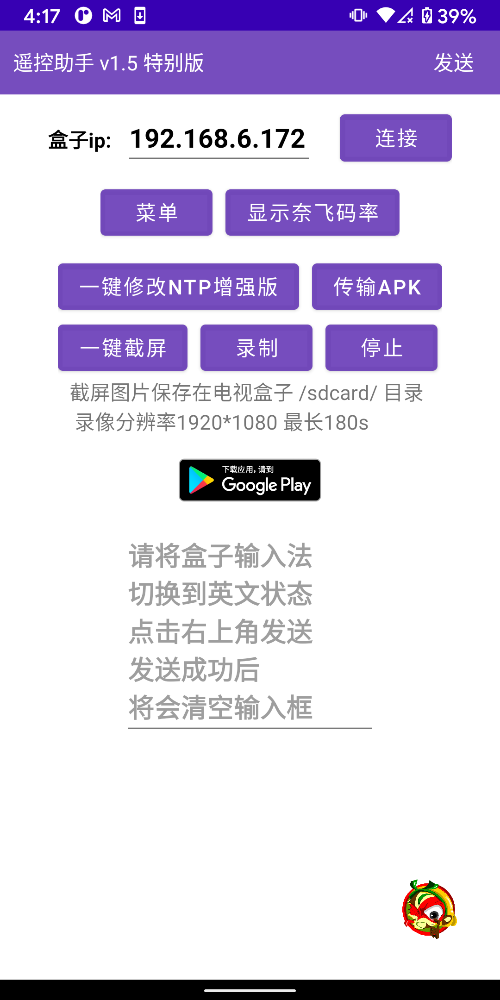

# 🎈遥控助手下载地址和说明

## TV应用商店Emotn Store

<mark style="color:red;">国内下载地址一</mark>：[<mark style="background-color:red;">https://wwi.lanzoui.com/iNBshwa6egd</mark>](https://wwi.lanzoui.com/iNBshwa6egd)<mark style="background-color:red;"></mark>

国外下载地址二：[<mark style="background-color:blue;">https://drive.google.com/file/d/1KsqRvGbU9-IzHZkcc8aymPyXM6Nqny7m/view?usp=sharing</mark>](https://drive.google.com/file/d/1KsqRvGbU9-IzHZkcc8aymPyXM6Nqny7m/view?usp=sharing)<mark style="background-color:blue;"></mark>

<mark style="color:red;">官网下载</mark>：[https://app.emotn.com/](https://app.emotn.com)

## 遥控助手v1.5 特别版（for 手机app）

<mark style="color:red;">**地址一**</mark>   [<mark style="color:red;">**https://wwi.lanzoui.com/icLr1vmtmqf**</mark>](https://wwi.lanzoui.com/icLr1vmtmqf) <mark style="color:red;">**（够用版本 内涵一个当贝apk）**</mark>

「链接：https://pan.xunlei.com/s/VMmOClK0hdSSEXsqk6YplAAiA1 提取码：d8se”复制这段内容后打开手机迅雷App，查看更方便」

<mark style="background-color:blue;">**地址二**</mark>：<mark style="background-color:green;"><mark style="color:red;">谷歌网盘<mark style="color:red;"></mark><mark style="background-color:green;">：（完整版本APK比较大 ）（与视频一致的版本）</mark>[https://drive.google.com/drive/folders/1OSfMViLjO1ybWaV96fvKe4zUbLrV7sZB?usp=sharing](https://drive.google.com/drive/folders/1OSfMViLjO1ybWaV96fvKe4zUbLrV7sZB?usp=sharing)

<mark style="color:red;background-color:red;">**必看视频说明**</mark><mark style="background-color:red;">：</mark>[<mark style="background-color:red;">https://www.ixigua.com/7020988161757020711</mark>](https://www.ixigua.com/7020988161757020711)<mark style="background-color:red;"></mark>

## 遥控助手V1.7  fire tv&#x20;

&#x20;<mark style="background-color:yellow;">说明：这个版本集成了两个应用市场。另外修复了【显示奈飞码率】按钮和fire tv语音键冲突的问题。</mark>

国内下载地址一： [https://wwi.lanzoui.com/iPjiCwcv31e](https://wwi.lanzoui.com/iPjiCwcv31e)

国外下载地址二：[https://drive.google.com/file/d/1IycoaiNcgbdnjRx3ApVGMKrgzwsylNAW/view?usp=sharing](https://drive.google.com/file/d/1IycoaiNcgbdnjRx3ApVGMKrgzwsylNAW/view?usp=sharing)

<mark style="background-color:green;">更新说明：适配了fire tv stick 4K MAX，解决亚马逊语音按键和显示奈飞码率按钮冲突问题</mark>

### &#x20;<mark style="color:red;"></mark> <mark style="color:red;"></mark><mark style="color:red;">**使用须知：**</mark>

**1**、电视盒子和手机需要连接到同一个wifi下。

**2**、其次电视盒子<mark style="color:red;">需要打开ADB开关</mark>。一般来说是需要在设置里--关于---内部版本号或者android版本号 点击4次 激活开发者选项后，找到【<mark style="color:red;">usb调试</mark>】或者【网络调试】或者【ADB开关】或者【远程调试】后打开它。

**3**、<mark style="background-color:red;">点击app里的连接按钮，此时盒子弹出授权提示的弹框，用遥控器点击允许后，app会提示连接成功</mark>

## &#x20;功能一：修改时间不正确导致的网络受限问题 &#x20;

点击app里的 【一键修改NTP地址】按钮，之后提示修改成功，然后点击左下角【重启】按钮，待盒子重启后，检查时间是否正确。网络受限问题是否解决。

## &#x20;功能二：输入订阅地址

&#x20;在盒子上光标定位到输入框，且确保当前输入法为**英文状态，**在app的输入框里粘贴地址，点击**发送**按钮

## <mark style="color:red;">****</mark>[<mark style="color:red;">**相关核心代码和原理  点击直达**</mark>](test/google-tv-xiu-gai-ntp-fu-wu-qi-di-zhi.md)<mark style="color:red;">**👈 （用电脑修改）**</mark>
