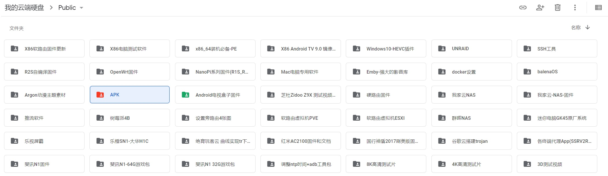

# 电视盒子APK

## &#x20;Youtube安装包 适合Android 5.0以上系统


免谷歌框架且可登录的youtube安装包，解压后使用


## Netflix TV版本 适合Android 5.0以上系统

【Netflix TV版本】[https://wwi.lanzoui.com/iRt9sf4dpqd](https://wwi.lanzoui.com/iRt9sf4dpqd)&#x20;

&#x20;Netflix授权的电视盒子有哪些？[https://docs.google.com/spreadsheets/d/11FE6lKRcVNMdKmMve0Mo465IvufYZO\_QPjJZ3c4dJmw/](https://docs.google.com/spreadsheets/d/11FE6lKRcVNMdKmMve0Mo465IvufYZO\_QPjJZ3c4dJmw/edit#gid=0)

## 低版本电视盒子 Android 4.4 能安装的定制版KODI-17

[https://drive.google.com/drive/folders/1Q3EuAT8BMBFzGjX2ipP5-1f3kYQFT0Rr?usp=sharing](https://drive.google.com/drive/folders/1Q3EuAT8BMBFzGjX2ipP5-1f3kYQFT0Rr?usp=sharing)

&#x20;代表机型：**当贝H1**

## &#x20;网盘所有APK

&#x20;[https://drive.google.com/drive/folders/1GrqLTgx1raTQWXxIAPPdo-pT6ZtyiJc2?usp=sharing](https://drive.google.com/drive/folders/1GrqLTgx1raTQWXxIAPPdo-pT6ZtyiJc2?usp=sharing)

