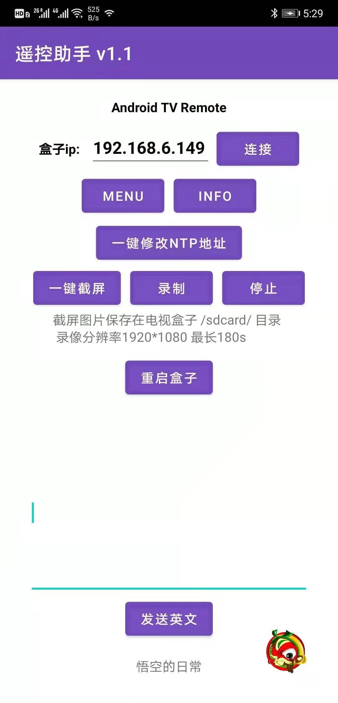

# 🎈Google TV

##  Google TV是什么 开箱视频↓

 [https://youtu.be/scoY0QCb9Lc](https://youtu.be/scoY0QCb9Lc)

 相关视频 如果你是**新手** 最好看一看： 

1、Google TV 如何安装第三方App: [https://youtu.be/waiOukl-Kw4](https://youtu.be/waiOukl-Kw4) 

2、Google TV如何解决网络受限的问题 [https://www.youtube.com/watch?v=0H27uZYdkxk](https://www.youtube.com/watch?v=0H27uZYdkxk) 

3、Google TV如何打开未知源 [https://www.youtube.com/watch?v=CXRkUVow1V0](https://www.youtube.com/watch?v=CXRkUVow1V0) 

4、Google TV 如何使用拓展物拓展容量和使用u盘 [https://www.youtube.com/watch?v=A6079ub6T0I](https://www.youtube.com/watch?v=A6079ub6T0I)

5、**Google TV 常见的5个问题和解决方法**：[https://www.youtube.com/watch?v=gHb1NVy8yow](https://www.youtube.com/watch?v=gHb1NVy8yow&t=63s)

##  如何购买？

 1、如果你有一定的基础,你可以从闲鱼直接购买

 2、如果你是新手、实在不想采坑 可以来我的[微店](%20https://k.koudai.com/CRG9VqO9)，我会帮你弄好。[ https://k.koudai.com/CRG9VqO9](%20https://k.koudai.com/CRG9VqO9)

 3、_**记住，无论从哪里买，尽量购买激活后的版本，并咨询卖家此系统是否能够更新到最新版，如果不能更新到最新版，不要买！因为有的机器 是问题机型，是无法安装更新的，详细解说看我的视频：↓**_ [_**https://youtu.be/9wEsMFVZzHk**_](https://youtu.be/9wEsMFVZzHk)_\*\*\*\*_

##  扩展阅读↓

  [其他原生安卓盒子提示网络受限的问题](../test/google-tv-xiu-gai-ntp-fu-wu-qi-di-zhi.md)

##  首次激活连不上wifi？

此问题可能是安卓原生TV系统时间不正确导致的，尝试在软路由OpenWrt里设置自定义劫持域名 

软路由里把time.android.com劫持到 203.107.6.88\(阿里云的ntp服务器\)就能解决原生安卓时间不对的问题 了 

**具体步骤：openwrt---网络----dhcp/dns----host和解析文件拉到最下边----自定义挟持域名或者自定义dns解析**

##  已联网，但是无法访问互联网？网络受限？

 此问题可以参考：[这篇文章](../test/google-tv-xiu-gai-ntp-fu-wu-qi-di-zhi.md)👈

 更新： 目前除了上述方法，还可以使用我开发的app来一键修改NTP服务器地址来解决此问题。

 **使用须知：**

**1**、电视盒子和手机需要连接到同一个wifi下。

**2**、其次电视盒子需要打开ADB开关。一般来说是需要在设置里--关于---内部版本号或者android版本号 点击4次 激活开发者选项后，找到【usb调试】或者【网络调试】或者【ADB开关】或者【远程调试】后打开它。

**3**、点击app里的连接按钮，此时盒子弹出授权提示的弹框，用遥控器点击允许后，

  点击app里的 【一键修改NTP地址】按钮，之后提示修改成功，然后点击【重启】，待盒子重启后，检查时间是否正确。网络受限问题是否解决。

