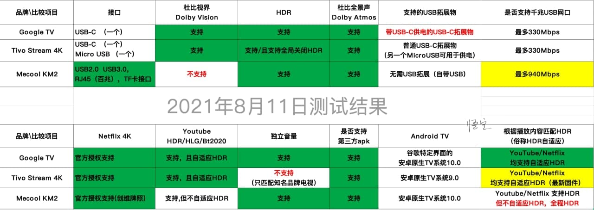

# 🎈Tivo Stream 4K

本来这不是一个问题。不过最近群友频繁提问。我就在此说明一下步骤。

首先要知道。tivo 的网站并**不是随便注册**的。你**必须**拥有一台tivo stream 4k的设备才行，因为它的注册流程是，**先激活--在提示你注册**。这样网站就能进入到注册流程了。如果你没有设备，直接点击Create Account 是无论如何无法进入注册页面的。

1、访问 [https://www.tivo.com/activate/stream4k/](https://www.tivo.com/activate/stream4k/)  

2、打开tivo 电视盒子，会提示你激活，此时电视盒子会给你生成一个激活码

3、将激活码填写到tivo网站。如图所示：

4、点击 底部的**激活按钮** 后，会跳入注册流程。

此时会要求你输入**美国地址**，注意这里的美国地址不可以随便填写。是要符合【实际】的美国地址，地址可以是假的，但是不能写个美国根本不存在的州。比如你写个beijing 肯定不是美国地址。你可以在谷歌搜到免费可用的美国地址。你可以参考我。我这边直接填写了 我转运公司提供的美国免税仓库的地址 如下图：**你可以照抄**。

这些写好之后 进入下一步 就能激活成功了

 如果你不想踩坑 作为新手 你可以在我的微店找到 我来帮你激活   [微店地址：这里](https://weidian.com/fastorder.html?itemID=4377477438)

##  Tivo 的拓展坞

  最便宜的最简单的拓展坞只有10元左右，如图地址为：[https://item.jd.com/100007614279.html](https://item.jd.com/100007614279.html)

 

## 一些竞品对比

## 如何匹配遥控器品牌？

#### 设置——遥控器和配件里——tivo remote

#### Remote Setup

The TiVo Stream 4K remote can be set up to control your TV, sound bar, or A/V receiver's volume, mute, and input functions.

1. Press the circle button on the remote to go to the Android TV home screen, then choose the gear icon to go to the Android TV settings menu. 

2. Choose Remote & Accessories &gt; TiVo Remote.

3. Choose one of the options on this screen:
   * **Change TV Setup:** Use this option to control your TV's power, input, and volume.
   * **Change Audio Setup:** Use this option to control an external audio device \(e.g., a sound bar or A/V receiver\).
   * **Change Volume Control:** Use this option to switch between controlling the volume on your TV or audio device \(sound bar or A/V receiver\).  This function can be useful for using ARC with an Audio device.

