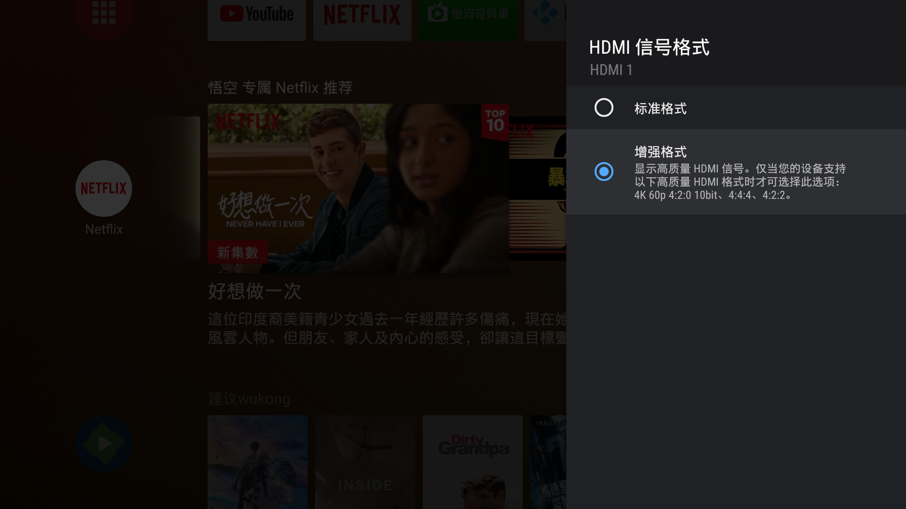

# ❓高频提问汇总↓↓↓

## ❓群主的网盘地址是？

[**谷歌网盘地址**](https://drive.google.com/drive/folders/14fgYztKnT2kjOo7Mpu\_bTiqUqTYp6eYx)（**三年整理的资料↓↓↓**）

[https://drive.google.com/drive/folders/14fgYztKnT2kjOo7Mpu\_bTiqUqTYp6eYx](https://drive.google.com/drive/folders/14fgYztKnT2kjOo7Mpu\_bTiqUqTYp6eYx)&#x20;

## ❓Google TV 总是显示已连接无法访问互联网？或者时间总是不正确怎么办？

&#x20; **方法一：参考下面的修改路由器host的方式   ⬇️⬇️⬇️  方法二：**[答案在这里——————这里](test/google-tv-xiu-gai-ntp-fu-wu-qi-di-zhi.md)   ←&#x20;

## &#x20;❓**Google**首次激活连不上wifi？

此问题可能是安卓原生TV系统时间不正确导致的，尝试在软路由OpenWrt里设置自定义劫持域名&#x20;

软路由里把time.android.com劫持到 203.107.6.88(阿里云的ntp服务器)就能解决原生安卓时间不对的问题 了&#x20;

**具体步骤：openwrt---网络----dhcp/dns----host和解析文件拉到最下边----自定义挟持域名或者自定义dns解析**

&#x20; 如果你是梅林系统的路由器，请按照模版格式，填写在自定义dnsmasq的文本框里

&#x20;  比如： **203.107.6.88 address=/time.android.com/203.107.6.88**

** 如果你不是OpenWrt和梅林系统，那恐怕需要找到/etc/hosts这个文件自行编写了。另外一个终极且一定有效的方式：购买一个境外的手机号，比如香港手机号，放在手机开热点wifi。此法可行。**

****

**其他路由器系统怎么办？参考恩山论坛的方法，比葫芦画瓢看看：⬇️ **[**https://www.right.com.cn/forum/thread-794878-1-1.html**](https://www.right.com.cn/forum/thread-794878-1-1.html)****

## &#x20;❓视频流媒体Apple TV+ 可以安装在Android TV吗？

&#x20;目前**默认自带**apple tv+ Android TV电视盒子有**`Google TV`**和**`Fire TV Stick 4K`**，

&#x20;这两款是保证可以运行播放的。不过字幕还是偏小。

&#x20;`其他Android TV盒子 `：我正在测试。实测`MeCool KM2` 可以使用APK Mirror网站提供的2.2版本。

&#x20;Sony电视：经过实测，无论安装包名为 `com.apple.atve.sony.appletv`.  3.0的APK

&#x20;还是安装包名为 ` com.apple.atve.androidtv.appletv` &#x20;

&#x20;2.2 版本 **均无法使用**。其中针对sony的3.0版本apk表现为**无法登录**，2.2通用版本表现为**播放闪退**

` APK 下载地址  2.2 通用版`：[https://www.apkmirror.com/apk/apple-inc/apple-tv-android-tv-2/apple-tv-android-tv-2-2-2-release/apple-tv-android-tv-2-2-android-apk-download/](https://www.apkmirror.com/apk/apple-inc/apple-tv-android-tv-2/apple-tv-android-tv-2-2-2-release/apple-tv-android-tv-2-2-android-apk-download/)

`Sony 电视 3.0 版本`：[https://www.apkmirror.com/apk/apple-inc/apple-tv-android-tv/apple-tv-android-tv-3-0-release/apple-tv-sony-android-tv-variant-3-0-android-apk-download/](https://www.apkmirror.com/apk/apple-inc/apple-tv-android-tv/apple-tv-android-tv-3-0-release/apple-tv-sony-android-tv-variant-3-0-android-apk-download/)

&#x20;此问题未完待续---

## &#x20;❓悟空你自己的x86软路由刷的固件是哪个版本？从哪下载？

无特殊需求没必要总是更新固件，稳定使用是第一位[https://share.weiyun.com/sEcQrutu](https://share.weiyun.com/sEcQrutu)

## &#x20;❓自己在用的VPS节点是哪家？

[https://i.ok4.icu/9Wy](https://i.ok4.icu/9Wy)

## ❓电视盒子怎么看Netflix分辨率？

接个键盘（usb或者蓝牙），**按F4就能显示了**，再次按F4就消失。没键盘怎么办？可以使用我开发的安卓app来显示。遥控助手v1.3 [下载地址](https://github.com/ligl0702/Pan/releases/download/info/v1.3.apk)： [ https://github.com/ligl0702/Pan/releases/download/info/v1.3.apk](https://github.com/ligl0702/Pan/releases/download/info/v1.3.apk)

.png>)

## ❓每个终端最好的代理工具是什么？

手机端：安卓使用clash ，IOS（iPhone或者ipad）：使用小火箭或者quan

windows：clash等

mac：clash或者surge

&#x20;[**全部下载地址：直达 <-----**](https://drive.google.com/drive/folders/1qdp0R7xANFxPxUYI2qhgnhwrWsamADDz?usp=sharing)👈

## ❓Tivo Stream 4K、Google TV、Fire TV Strick 4K 选谁？

这问题一句话说不明白，建议看看我的视频。这些都是电视棒。各有各的问题。目前最新的是google tv。

相关文章：[https://www.bilibili.com/read/cv7831822](https://www.bilibili.com/read/cv7831822)

相关视频：[https://www.bilibili.com/video/BV16i4y1E72o](https://www.bilibili.com/video/BV16i4y1E72o)

相关视频：[https://www.bilibili.com/video/BV16a411c74z](https://www.bilibili.com/video/BV16a411c74z)

## ❓如何激活Tivo Stream 4K？

这个机器激活门槛有技巧。具体大家看这篇文章 [**这里 ←**](dian-shi-he-zi-tui-jian/ru-he-ji-huo-tivo-stream-4k.md)****

## ❓电视盒子看油管和奈飞，软路由应该使用什么模式？

最好使用**绕过大陆ip**模式，有的插件里叫做 **大陆白名单模式** 都行。 gfwlist模式有**可能**不齐全造成**看不了**奈飞等状况的出现。

## ❓请问电视盒子看油管和奈飞要用什么电视盒子？

奈飞的门槛较高，要选择**奈飞授权**的电视盒子。以下是个人推荐的几款盒子都能选择，肯定不翻车。

**电视棒类型：**Fire tv Strick 4K，Tivo Stream 4K，Google TV。

**电视盒子类型**：Apple TV 4K，Shield TV 2017美版 ，Shield TV Pro 2019，Mibox S，mibox3国际版（港版，韩版，美版都行）Roku TV ，Mecool KM2等

&#x20;详细列表参考：[https://www.androidtv-guide.com/streaming-gaming/netflix-amazon-atv-certified](https://www.androidtv-guide.com/streaming-gaming/netflix-amazon-atv-certified)

## ❓你视频中货架上右上角的电子时钟是什么牌子

那是一个国外的品牌，叫做**Lametric Time**，只能淘宝代购或者自己从官网和美亚海淘。大约1500元左右。

## ❓**你视频背景的白色货架是从哪里买的？**

**淘宝搜索 五金少女，或者去看他们的视频就能找到了。**

## ❓主要看国内的节目，用什么盒子比较好？

目前国产配置较好的有当贝B1、当贝B3Pro和极光3 pro。配置方面都是比较高的。都没有开机广告。

## ❓你视频中的产品来自哪里？

分以下几种情况：

1、自己买的。如果是自己买的 不会在视频中有什么备注的。

2、厂商赞助的。这里分为2种情况，一种是厂商送我了。一种情况是让我做完视频还要还回去。**但凡是厂商赞助的 ，我都会在视频中体现，告诉你们 这是送测产品。**

3、热心网友为了给我做视频素材借用的设备，用完需及时归还（无任何广告性质）。这种情况非常容易误解为是我自己买的。我每次极力说明，可还是有人误会。我想我以后把这类产品也加上水印备注吧。无奈！

## ❓你的盒子会卖掉吗？

我的电视盒子基本不会卖，极少会卖掉。原因是好多时候，网友需要我答疑解惑，我如果卖掉某个机型，可能后续就无法解答网友疑问了。再者，你可能对我不熟悉。我的频道全是仰仗各位盒子精爱好者才发展起来的，不会忘记垂直产品的。不过你可以关注我的闲鱼账号：**我要唰唰 **另外还有** **[**个人微**店](broken-reference)

## ❓**你的Tivo和火棒使用的OTG线从哪里买的？**

**闲鱼啊，链接就不发了吧。id是   卿卿bca**

## ❓不看奈飞和油管，推荐几款国产电视盒子？

坦白讲不带开机广告的电视盒子还是有点少，配置低的电视盒子不想推荐，因为可能以后还需要升级。目前比较看好的几款是当贝b1/b3 pro ,腾讯极光3pro 。小米的话配置较低，但是小米也有优点那就是os做的不错。配合米家生态链。但是2021年确实也没啥新配置。所以就不推荐了。

## ❓索尼电视应该使用哪一个油管APK或者奈飞APK？

【火棒Youtube-4K免谷歌框架】[https://drive.google.com/file/d/1EQfc0KlLThprdYoSZuAiAYi8jkYK0u8Q](https://drive.google.com/file/d/1EQfc0KlLThprdYoSZuAiAYi8jkYK0u8Q)

用此版本 可以免谷歌框架并且可以登录。

【Netflix TV版本】[https://drive.google.com/file/d/19fyqpWg9E2mX8RqZDrCm4N\_xbD0BA5Ba/view?usp=sharing](https://drive.google.com/file/d/19fyqpWg9E2mX8RqZDrCm4N\_xbD0BA5Ba/view?usp=sharing)

&#x20;更新【**Youtube Kids】**，有娃党可以[下载使用](https://drive.google.com/file/d/1CL0jsVoBvcKzQqUtJeEJT9U-op\_b80DO/view?usp=sharing)：

[https://drive.google.com/file/d/1CL0jsVoBvcKzQqUtJeEJT9U-op\_b80DO/view?usp=sharing](https://drive.google.com/file/d/1CL0jsVoBvcKzQqUtJeEJT9U-op\_b80DO/view?usp=sharing)

## ❓Google TV、Shield TV等原生盒子的激活方式除了软路由还有其他办法吗？

&#x20;可以使用香港手机卡，手机开热点完成。比如这种（**不是推荐仅仅是举例**）：[这里这里](https://traveldetail.fliggy.com/item.htm?id=597315400006\&ali\_refid=a3\_430583\_1006:1125178942:N:TmlkEr4toFiovv16%2FtNotQ%3D%3D:25ab86d7783981df997adbb6f0086cbf\&ali\_trackid=1\_25ab86d7783981df997adbb6f0086cbf\&spm=a230r.1.14.1) **⟵**

## ❓红米Ac2100刷机文档和固件在哪？



## ❓一句话盘点下你视频出现的热门电视盒子的短板或者缺点？

| 机型                        | 缺点/短板                             | 支持奈飞  |
| ------------------------- | --------------------------------- | ----- |
| **Shield  TV Pro 2019**   | **油管不支持HDR**                      | **是** |
| **Tivo Stream 4K**        | **激活门槛较高 需要填写非大陆地址是**             | **是** |
| **Mibox  S**              | **不支持杜比视界和杜比全景声**                 | **是** |
| **Google TV**             | **只有一个Type-C接口不是很方便 这也导致拓展物成本高**  | **是** |
| **Shield TV 2019（2G+8G）** | **没有USB接口比较不方便，无法连接usb鼠标或者键盘是**   | **是** |
| **Fire TV Stick 4K**      | **不支持简体或者繁体中文**                   | **是** |
| **Zidoo Z9X**             | **不支持奈飞**                         | **否** |
| **当贝B3 PRO**              | **长期缺货 **                         | **否** |
| **当贝Z1 PRO**              | **目前加的一些游戏和视频会议功能 很多人暂时用不上，价格略高** | **否** |
| **Apple TV 4K 第2代**       | **油管HDR没有自适应开启**                  |       |

## 备注：Google TV 目前增加了Apple TV+的流媒体支持

## ❓**Google TV 拓展物的选择？**

1、 由于Gtv电视棒只有一个typec接口，因此拓展物要买**带typec供电或者pd供电**的拓展物。

2、拓展的目的不是为里拓展千兆网口，实测如果拓展千兆网口，其速率仅为300多Mbps和无线基本一致，甚至不如无线的速率，因此拓展物的网口不是必须的。通常用无线wifi更加实际。

3、拓展的最重要目的是为里方便安装更多第三方app，避免存储空间不足，空间不足会导致kodi等播放软件缓存不足，进而可能导致高码率视频播放卡顿。

4、**只有非google play下载安装的应用才能使用拓展空间**。比如当贝市场安装或者u盘安装的apk才使用拓展的空间。

5、**视频里用过的拓展物**的型号为：[**绿联50252**](https://item.jd.com/100000270729.html)**   视频里用的U盘是：**[**闪迪酷铄(CZ73)**](https://item.jd.com/2148924.html)****

## ❓**哪里可以下载4K或者8K测试片？**

**如果你懒得自己找，可以在我的谷歌网盘自行下载**

****[**4K测试片**](https://drive.google.com/drive/folders/1dkitmr6e\_m8fkSliD3DVp2xA2sPYByFl?usp=sharing)← [**8K测试片**](https://drive.google.com/drive/folders/1W1j7Ik4vxCz0tctLcRUSD1EU5lEYyrmk?usp=sharing)←[ **总目录**](https://drive.google.com/drive/folders/14fgYztKnT2kjOo7Mpu\_bTiqUqTYp6eYx)←

## ❓LG电视换区代码是什么？

部分地区码可以参考：

北美：1793 欧洲：3122 澳大利亚：4816 北欧：0 **香港：13869** 台湾:13333 **国行：13741**&#x20;

注意换区不能改变你的**网络环境**，像NF这样的软件你必须有相应的环境才可以。另外如果发现任何换区后影响到使用的地方你可以切换回国行。本次问答是给那些喜欢国外流媒体的人一种换区方案。初衷是为了方便大家换区而已。不引导不怂恿任何人换区。你自愿。

备注：**切换到香港区域之后**，必须在位置里再次选择-香港 才可以真切换到港区

****[**相关视频**](https://www.bilibili.com/video/BV1TJ41147)：[https://www.bilibili.com/video/BV1TJ41147](https://www.bilibili.com/video/BV1TJ41147we?from=search\&seid=10064138091965696631)

## ❓Fire TV Stick 4K 如何安装第三方apk

**首先开启ADB方法如下**：**`Settings -my fire tv- developer opinions-ADB debugging ON`**

**其次adb使用方法，fire tv和你的电脑要处于同一个局域网，即连接了同一台路由器。**

**连接adb ：`adb connect 192.168.xx.xx`**

**安装apk**：**`adb install apk路径`**（一般拖拽到命令行即可）

相关视频，视频第五点：[https://youtu.be/hNnkwsM8t0Y](https://youtu.be/hNnkwsM8t0Y)



## &#x20;**Google TV 连接到Sony电视，无法打开4K 60hz 杜比视界？怎么回事？**

** 回答：出现这个问题是因为HDMI信号格式的问题，默认是标准格式。要开启增强格式才行。当然有时候sony电视也会出现一些bug，比如本来开启了增强格式，过一段时间它自己跳回了标准模式。因此我们最好是自行检查一下。具体检查方法如下：**

**设置--观看电视--外部输入---HDMI信号格式---选择增强格式**

...永远未完待续

## ↖️页面左上角是菜单⟵

