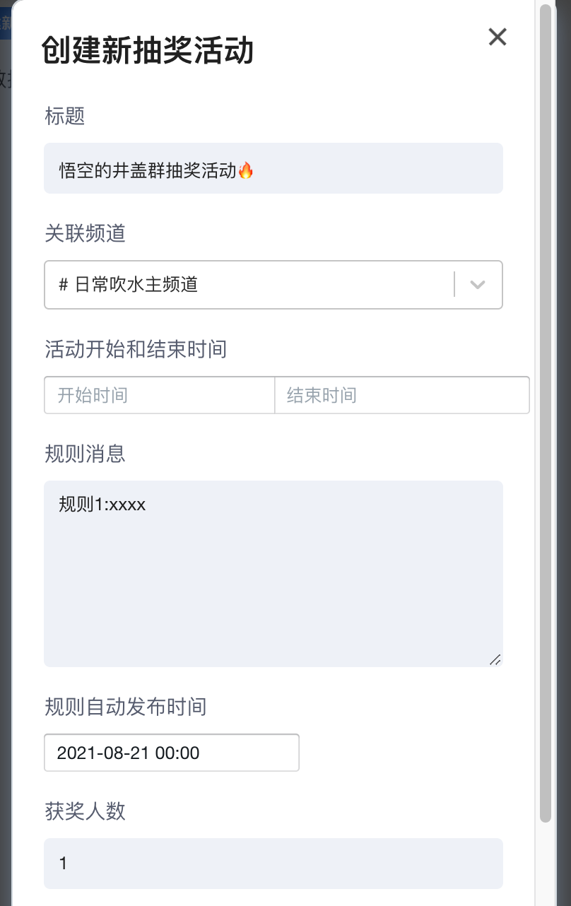

# ❇️ 国内群组

## \*\*\*\*[ **&gt;&gt;&gt;&gt;&gt;&gt;&gt;&gt;&gt;&gt;&gt;&gt;&gt;&gt;&gt;&gt;国内群组点击直达**](https://jg.17173.com/i/f1PutQow)**&lt;&lt;&lt;&lt;&lt;&lt;&lt;&lt;&lt;&lt;&lt;&lt;&lt;&lt;&lt;&lt;&lt;&lt;&lt;&lt;&lt;**

## 使用井盖作为国内大群的原因？

首先很感谢你能认真看完这些文档手册。在国内最好的群莫过于腾讯QQ群。它的地位，难以撼动。本人也是Q龄17年的老用户了。人们对于QQ群的感情，是毋庸置疑的。但是三年前，我成为一名up主，我必须创建属于自己的交流群。这个群涉及到群友的方方面面 ，包括不限于日常吹水、技术讨论、设备装备等诸多话题。在认识井盖app之前，我就一直有一个愿景，那就是希望只建立一个国内群组。对、你没有听错，只有一个。为什么是一个，原因就是我是一个人。我要集中所有力量，我要节省时间、加快效率。“一呼百应“

### 人数

        QQ群的人数上限为3000人，这个数字对于一个接近10万观众的up主，是远远不够的。而我需要一个群的人数至少为1万人。因此qq即便是如此优秀，也无法满足我的愿望。并且如果你建立3k的qq群，每年还有一笔不小的会员费。我如果建立10个3k群。想想还是挺贵的呢。你可能看到我目前qq群不过4000多人呀 ，也没有很多啊。但是这是我长期限制流量的结果。我并没有放开手脚去推广。

### 功能侧重点

#### **话题**

前文提到，群虽然只有一个，但是话题却无限丰富，qq群由于没有话题功能，所以人们聊的大多比较分散。一些小众却垂直的内容可能得不到什么认同感和话语权。往往大家讨论的都是耳熟能详的热门话题。而井盖app成立初衷就是做最好的[分话题的群聊app](https://jg.17173.com/i/f1PutQow)。其中井号代表话题的意思。一个群可以有无数个话题，每一个感兴趣的话题，都可以成为一个分小组或者分论坛、分群聊。这样把兴趣爱好一致的人黏在了一起。吵架的可能性也进一步降低。和谐度大大增强。

**群聊小组就像是App Store里的app**

你可以在这个商店里，直接看到你感兴趣的群组。这里涉及游戏、动漫、技术、美术等诸多兴趣小组。大家都是公开的，有些群组甚至，点进去不加入也能看看人家在聊什么。非常的开放和自由。等你感兴趣的时候再加入。每个人都有权利创建属于自己的井盖群，而井盖群最大的优点就是**没有人数上限**，这一点你们可能不感冒，但是对于up主至关重要。并且井盖群可以设置N多个话题小组，不同于QQ多讨论组，这些你成立的话题小组，归属于同一个群。表面上看是分开的，实际还是在一个群里。既防止了小众话题被人刷屏，同时又能保持同一个群的一致性。  

**机会**

井盖目前已经一周岁了。它还很年轻。但是同时你应该敏锐的看到，这是一种机会。假设你就是一个有影响力的人，完全可以自己建立群组，早日维护好自己的私域流量。这个红利期可能不会太久。我的很多群友不仅加入了我的井盖群组，同时他们也在创建属于自己的兴趣群组。甚至很多群友的兴趣群组比我的群组人数还要多。所以我说，新的app也许当下是小众的，但是未来呢？

### 井盖抽奖活动

      为了调动大家的积极性，我打算**定期举行**一些小的抽奖活动，活动的奖品一般都是和我视频相关的周边产品。也希望大家多多支持！！！！！[https://jg.17173.com/i/f1PutQow](https://jg.17173.com/i/f1PutQow)

  

### 推广我的井盖群组

      目前 我有两个QQ群。很抱歉没有太多时间维护好，我上线的概率并不高。所以qq群组的粘性也在逐渐降低，但是我发现人们喜欢在里面聊天吹水。这部分观众属于qq的重度用户。我不会删除qq群。尊重大家，也算是给大家一个交流的平台。但是后续我将不再推广QQ群组，人数将定格。集中好精力，维护我的井盖群组。今后大家有什么需要提问和讨论的都可以来井盖群组。[https://jg.17173.com/i/f1PutQow](https://jg.17173.com/i/f1PutQow)

点击直达：[https://jg.17173.com/i/f1PutQow](https://jg.17173.com/i/f1PutQow)

 

## **如何使用井盖？**[**点此处查看**](https://jgchat.gitbook.io) **帮助文档**

\*\*\*\*[ **相关推荐：我的国外群组 tg**](https://t.me/wkongsvlog)  **需要富强访问**

\*\*\*\*

