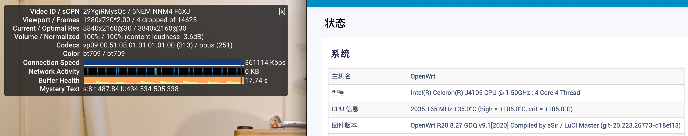
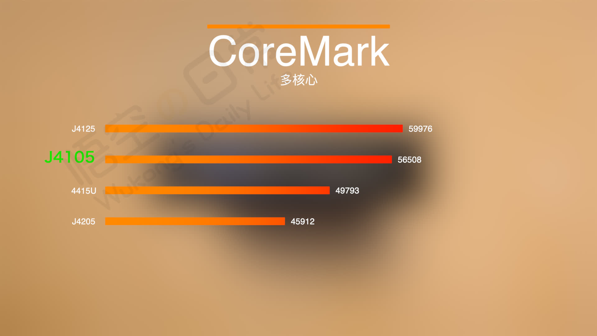
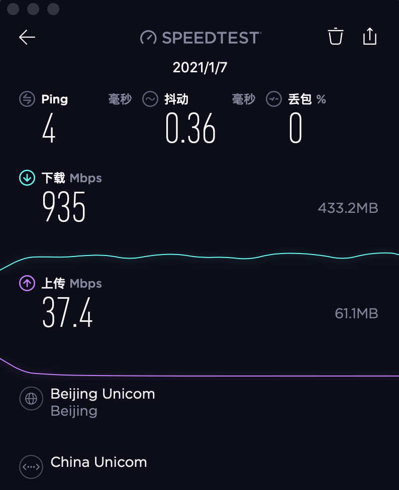

# ❣️J4105 软路由购买地址

👉[_**购买地址**_](https://k.koudai.com/EVSDREzj) 👈 👉[_**购买地址**_](https://k.koudai.com/EVSDREzj) 👈 👉[_**购买地址**_](https://k.koudai.com/EVSDREzj) 👈 👉[_**购买地址**_](https://k.koudai.com/EVSDREzj) 👈 👉[_**购买地址**_](https://k.koudai.com/EVSDREzj) 👈 

