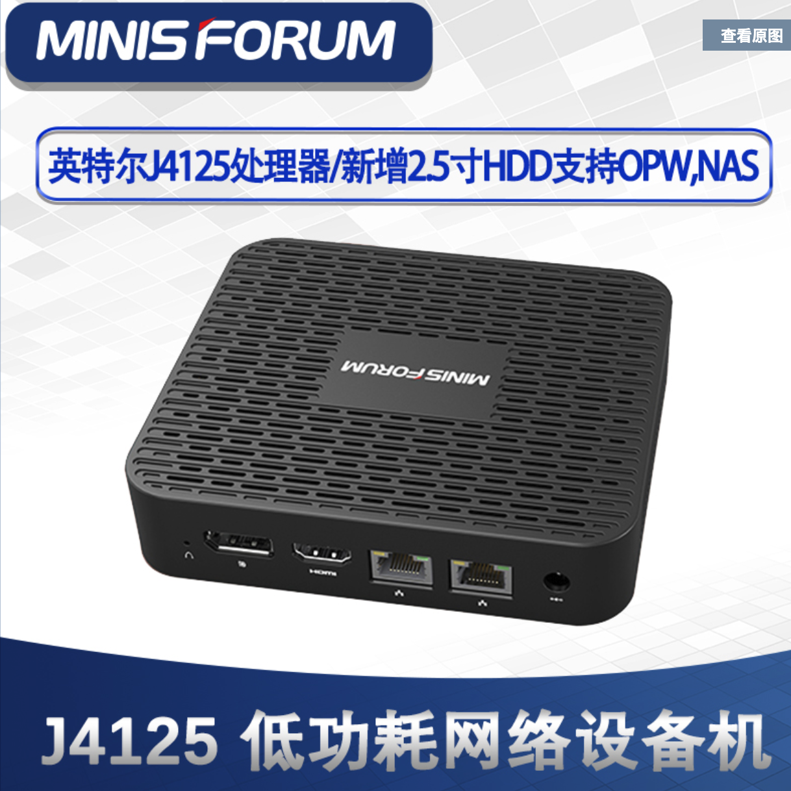
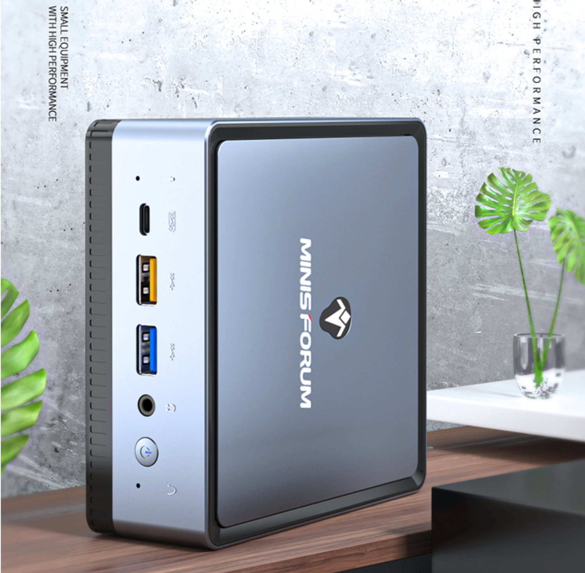
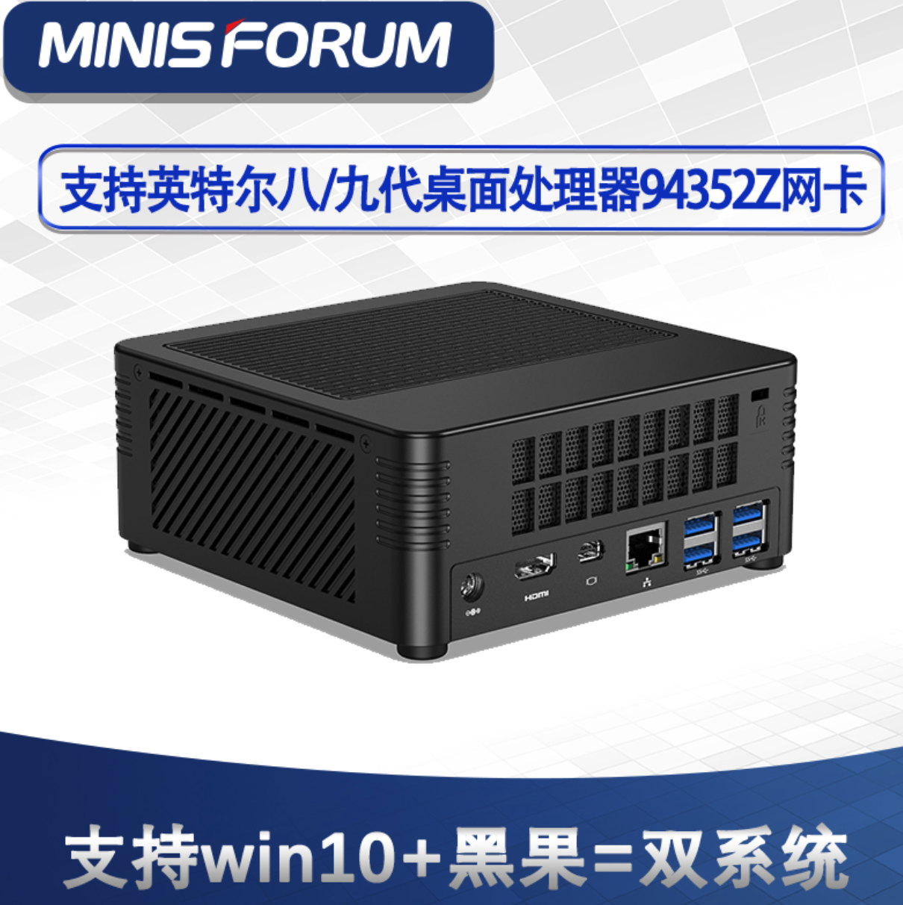

# ❣️Minisforum 品牌双千兆迷你电脑专区

## 1、[型号：GK 41 CPU：J4125 2.7Ghz  双千兆](https://item.taobao.com/item.htm?spm=a2oq0.12575281.0.0.4e811debjEiSPM&ft=t&id=621235181954)  暗号：wk 优惠20元



## 2、[型号：UM700 AMD锐龙R7-3750H](https://item.taobao.com/item.htm?spm=a2oq0.12575281.0.0.4e811debjEiSPM&ft=t&id=634669861371) 暗号：wk 优惠20元



## 3、[型号：H31\(支持黑苹果支持置换CPU\) ](https://item.taobao.com/item.htm?spm=a2oq0.12575281.0.0.4e811debq2hMTN&ft=t&id=624647252559)暗号：wk 优惠20元



## 4、型号：[X35G 酷睿i3-1005G1电脑雷电3台式机](https://item.taobao.com/item.htm?spm=a1z10.3-c-s.w4002-517659562.57.5b3331aeasOHWn&id=631691743228)



