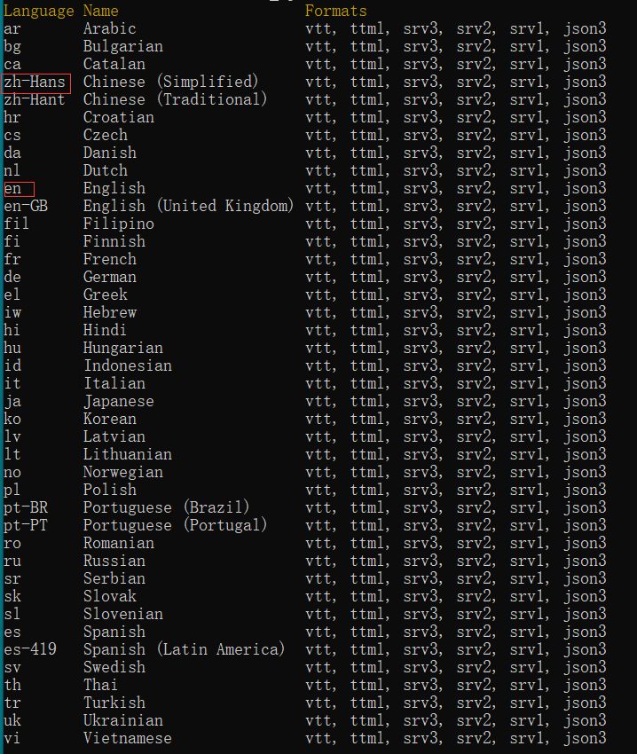
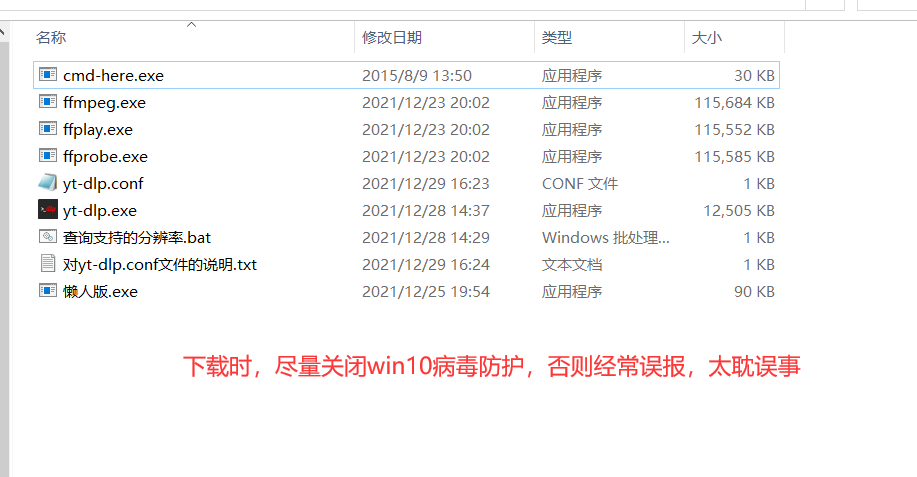

# 🥳 yt-dlp 使用简介

&#x20;      **前不久我做了一个yt-dlp的使用方法的分享。得到了很多人的互动和评论。由于视频篇幅有限，只是展示了它的基础用法。 即便用法比较简单，但是还有人不太会用。今天我就在我的百科文档里，把基础用法在详细解释一下。**

yt-dlp 主项目地址：**https://github.com/yt-dlp/yt-dlp** **,**目前支持的网站列表：

[https://github.com/yt-dlp/yt-dlp/blob/master/supportedsites.md](https://github.com/yt-dlp/yt-dlp/blob/master/supportedsites.md)

大家一定要多看人家官方写的文档。 另外附上我当天分享的<mark style="background-color:red;">**视频教程**</mark>：

[<mark style="color:red;">**https://www.ixigua.com/7046301673014493726**</mark>](https://www.ixigua.com/7046301673014493726)<mark style="color:red;">****</mark>

<mark style="color:red;"></mark>[<mark style="color:red;">**https://www.youtube.com/watch?v=u3LJVu8jNfM\&lc**</mark>](https://www.youtube.com/watch?v=u3LJVu8jNfM\&lc)<mark style="color:red;">****</mark>

顺便说一句， 养成随时看help文档的好习惯。通常一个项目，必然有一个-h的参数，当你迷茫时候，记得先执行 yt-dlp.exe -h 进行查看哈

以下代码是windows电脑为例，mac电脑用法类似。&#x20;

### 1、简单用法（一个参数URL） yt-dlp.exe 视频URL&#x20;

`yt-dlp.exe https://www.youtube.com/watch?v=u3LJVu8jNfM&lc` &#x20;

&#x20;URL可以是完整路径，也可以是后面的u3LJVu8jNfM\&lc 这里注意复制网址的时候，尽量不要复制后面的t=多少秒 这些信息。因为这些信息没有用。 我们用上述命令下载的文件就在yt-dlp所在的目录，格式有可能是webm格式

### 2、下载MP4 视频 （参数URL和format）&#x20;

如果我们必须下载MP4 格式，我们有两种方法&#x20;

#### A、借助ffmpeg 工具包转换为Mp4 ffmpeg工具包 我已经打包在网盘。文章末尾有全部懒人包

你可以可以自行下载 然后解压，解压后，三个文件放在yt-dlp 同一个目录即可，如果是mac电脑需要在配置文件中指明ffmpeg所在路径（后面在说）

举例：&#x20;

`yt-dlp.exe --merge-output-format mp4 https://www.youtube.com/watch?v=u3LJVu8jNfM&lc`

下载之后是一个<mark style="color:red;">Mp4的文件</mark>，中间有一个转换的过程，从webm——>mp4 只是过程太快 就是无感的。如果这样的参数下载下来可能清晰度是720P 而不是更高清晰度。如果想要更高清的下载，就需要借助使用配置文件yt-dlp.conf

#### B、借助后面音视频组合的下载方式 ，在下文中体现

### 3、使用配置文件 配置下载参数

我们在yt-dlp.exe 所在的目录，新建一个文本文件 命名必须是 <mark style="background-color:red;">yt-dlp.conf</mark> , 文本文件的编辑方式可以是记事本 也可以是任何文本工具。接写来我们开始定义，注意<mark style="background-color:red;">yt-dlp.conf</mark> 这个配置文件中，不能输入中文，包括中文注释。他目前是不兼容的，如果输入中文，那么下载可能报错，这里顺便说一句，yt-dlp.exe <mark style="background-color:orange;">最好放入到一个没有中文路径的目录下。避免出现一些不必要的bug</mark>。 打开<mark style="background-color:red;">yt-dlp.conf</mark> 文本后，输入以下基础参数

#### 下载文件保存的路径和名称

\--output "\~/Downloads/%(uploader)s/%(title)s-%(resolution)s.%(ext)s"

解释：\~/Downloads/ 你电脑的下载路径，通常在C盘，这部分你可以随意替换为你想保存的目录 uploader：频道名称或者up主名称 title：视频标题 resolution：视频分辨率 ext 这个可以暂时理解为视频扩展名 是必须要写的哈。

#### 进度条标题栏显示 这部分用处不大 可以不写

`--console-title --progress-template "download-title:%(info.id)s-%(progress.eta)s"`

#### 将下载的视频 转换为MP4格式，很重要。

`--merge-output-format mp4`

#### 下载的多国语言字幕，以下代表下载全部字幕

\--sub-langs all,-live\_chat

\##你可以可以只下载<mark style="background-color:red;">中文字幕和英文字幕</mark>，前提是这个视频的确有中文和英文字幕，注意不是翻译的。 你可以执行 --list-subs 参数查询这个视频支持的字幕&#x20;

举例：`yt-dlp.exe --list-subs` [`https://www.youtube.com/watch?v=220nXk_mJiE`](https://www.youtube.com/watch?v=220nXk\_mJiE)``

这样<mark style="background-color:red;">第一列就是语言tag</mark> 比如我们如果只想下载视频的中文和英文字幕 则可以在配置文件中这样写↓

#### 只下载英文和中文字幕

`--sub-langs "en.*,zh-Hans"`

#### 将字幕、缩图、视频描述等信息内嵌到视频文件

`--embed-subs`&#x20;

`--embed-thumbnail`&#x20;

`--embed-metadata`

&#x20;`--convert-subs srt`

写好以上几个基础的参数，对于windows平台来说 就OK了。 如果你用的是mac电脑，还需要加一行代码

#### ffmpeg tools for macOS

`--ffmpeg-location /Users/wukong/Desktop/macOS/ffmpeg`

<mark style="background-color:red;">要指定ffmpeg的路径，你的ffmpeg放在哪里了 这边就要写哪里，不可以照抄</mark>。

好，这样yt-dlp.conf 配置文件就算写好，这样每次执行下载的时候，它都会选择最高清晰度下载。

### 4、如何下载指定分辨率的视频？

&#x20;<mark style="color:red;">首先，查询这个视频支持下载的分辨率 格式，</mark>

这里包含了一个重要的信息，那就是文件ID 这里的文件ID 可以是音频文件的ID，也可以是视频文件的ID 利用 yt-dlp.exe -F 来查询，举例

`yt-dlp.exe -F https://www.youtube.com/watch?v=XA2YEHn-A8Q`

如图所示，如果想下载`1920x1080`分辨率的视频，我们需要`记录一下音频和视频id` 比如我们可以把140作为视频的音轨，把137作为视频的图像，这样最终会合成一个有图像有声音的视频

&#x20;如何书写命令，举例：

yt-dlp.exe https://www.youtube.com/watch?v=XA2YEHn-A8Q <mark style="color:red;">-f137+140</mark>

大家务必注意结尾处的写法。<mark style="background-color:red;">f137前面是有一个减号的</mark>。当然你还可以自由的组合音视频。 这样我们就把指定分辨率的视频下载出来了。

### 5、下载播放列表的所有视频 (注意你的流量哈)&#x20;

其实这个功能，api直接就支持，注意播放列表形如：

&#x20;`https://www.youtube.com/playlist?list=PL-Gg8EgJJQpDtccexkyEpSEK46m-epsFH`&#x20;

如何找播放列表 不用我多介绍了吧，去up主的主页，点击播放列表，出来的就都是播放列表了。

&#x20;那么命令为：&#x20;

`yt-dlp.exe https://www.youtube.com/playlist?list=PL-Gg8EgJJQpDtccexkyEpSEK46m-epsFH`

### 6、如何升级yt-dlp的版本？&#x20;

确认yt-dlp.exe 所在目录为非中文，注意包括父级目录 都不能有中文。

此时执行 `yt-dlp.exe -U`&#x20;

即可完成版本升级，更新到最新的Release版本。

### 7、我总结的懒人包

#### 谷歌网盘地址  [https://bit.ly/3zbdMWZ](https://bit.ly/3zbdMWZ)

#### 国内地址：[https://pan.baidu.com/s/13x6MmM15KbUsaR7f8J1NBA?pwd=a2jm ](https://pan.baidu.com/s/13x6MmM15KbUsaR7f8J1NBA?pwd=a2jm)

以上总结，若转载，请注明 来自悟空百科 ：

&#x20;[https://didiboy0702.gitbook.io/wukongdaily/ytdlp-shi-yong-jian-jie](https://didiboy0702.gitbook.io/wukongdaily/ytdlp-shi-yong-jian-jie)

